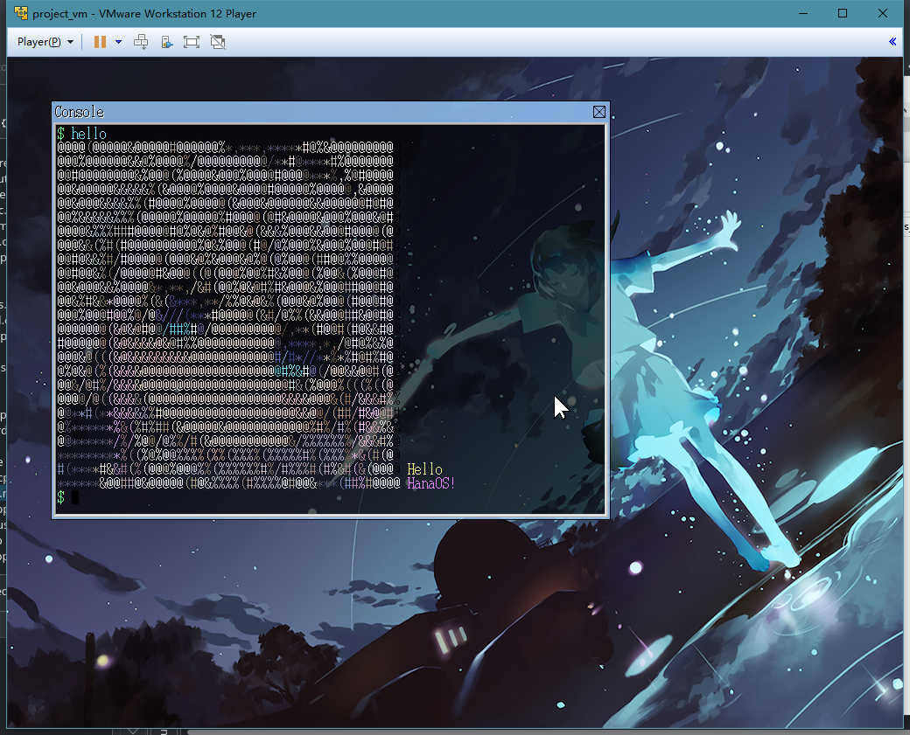
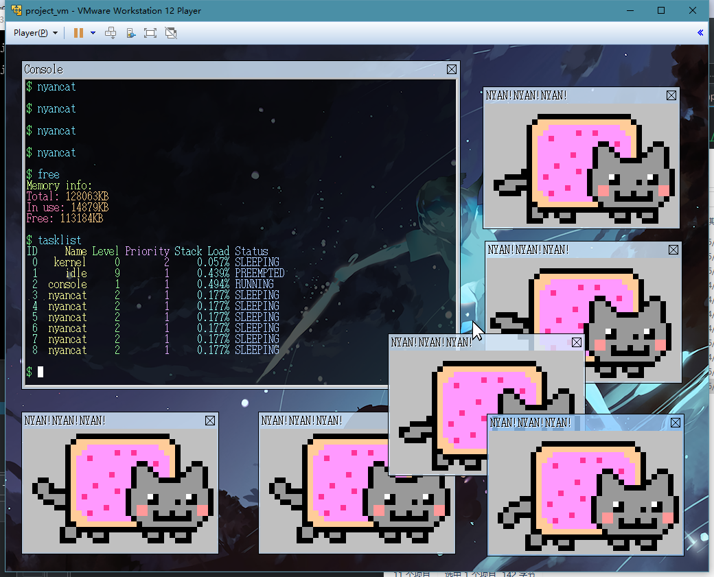
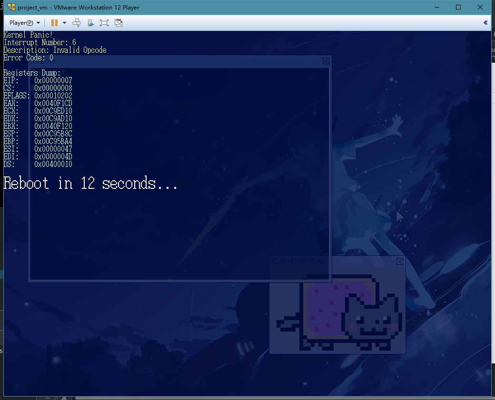
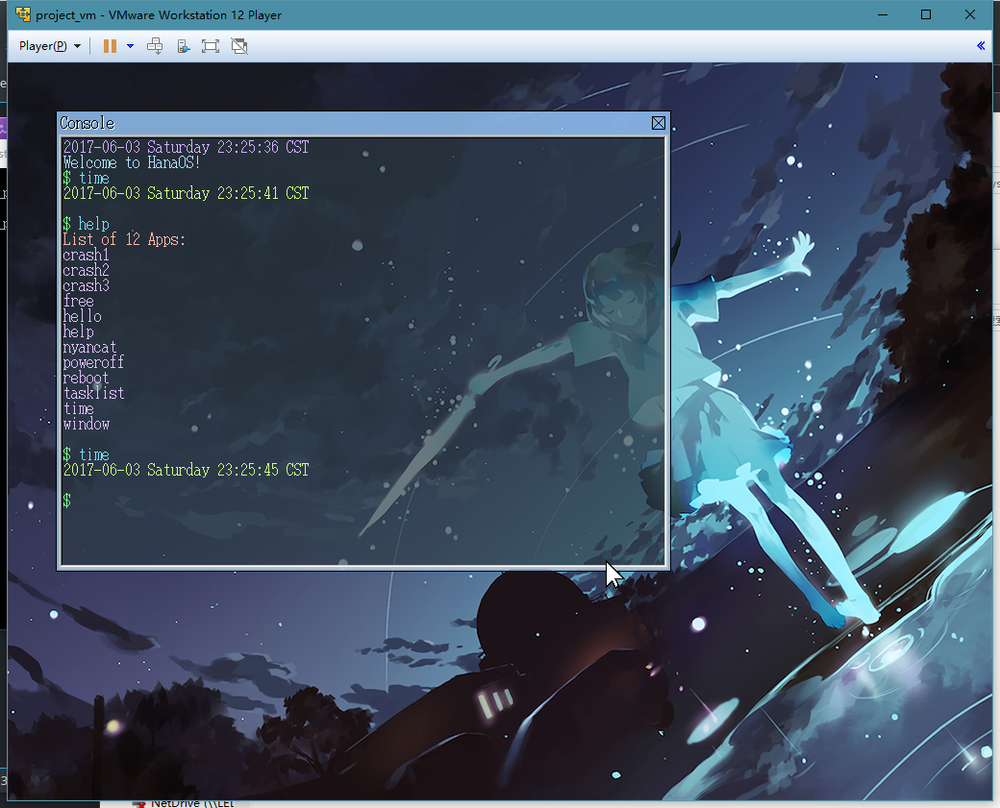

# Operating System(CS302) Project —— HanaOS

[](https://travis-ci.org/imxieyi/HanaOS)

**The final presentation turned out to be perfect!🎉**

1920x1080 resolution branch: [https://github.com/imxieyi/HanaOS/tree/high_resolution](https://github.com/imxieyi/HanaOS/tree/high_resolution)

## Introduction

This project is aimed to make an simple Operating System like [OSASK](http://osask.jp) using more recent technologies. With only 2 months to develop, I have skipped many critical parts for an traditional operating systems like paging and user mode. So it may easily crash while running. Since the final presentation has finished, I will stop development right here.

## Feature

1. Most of code in C++14 instead of pure C, which is rare for such operating systems.

2. GRUB2 [Multiboot](https://www.gnu.org/software/grub/manual/multiboot/multiboot.html) specification.

3. 32bit color, up to 4k resolution with appropriate configurations.

4. Graphic-rich console with transparent background.

5. Multi-tasking and support for several instances for one application.

6. Easy-to-use API including support for lambda expressions.

## List of apps

 - free (memory info)
 - hello (hello world!)
 - poweroff (ACPI shutdown)
 - reboot
 - tasklist (list of running tasks)
 - window (counter)
 - nyancat (NYAN!NYAN!NYAN!)
 - crash1 (jump to 0x0)
 - crash2 (divide by 0)
 - crash3 (jump to 0xffffffff)
 - time (read RTC time)
 - help (list of apps)
 - bclock (binary clock)

## Build Environment

Ubuntu 16.04 or above is recommended. If you cannot successfully set up the environment, please refer to [.travis.yml](https://github.com/imxieyi/HanaOS/blob/master/.travis.yml) which runs smoothly in Travis-CI containers.

## Dependencies

Install through apt:

```
sudo apt update
sudo apt install nasm g++-6 g++-6-multilib make xorriso mtools qemu grub-common grub-pc
```

## Build

Build .iso image:

```
make iso
```

The result file is build/hanaos.iso

## Run

Run in qemu (You must manually install qemu first):

```
make run
```

If you want to run it in VMware, you are required to add *rtc.diffFromUTC = 0* in the .vmx file since VMware pass local time instead of UTC time as hardware time to virtual machines by default.

## Some explanations

1. What inside [bgimg.hpp](https://github.com/imxieyi/HanaOS/blob/master/include/bgimg.hpp) is just a wallpaper which takes up 3MB in the kernel. In the 1920x1080 branch it even takes up 8MB. However the kernel is only ~70KB without it. But it does not affect performance. Feel free to modify it if you don't like it.

2. With the support for alpha color blending, moving a large window like console consumes huge amounts of CPU but still slow. So please be careful and DO NOT move your mouse too fast while dragging windows.

3. Apps are also linked with kernel since there is no file systems.

## Screenshots










## Credit
 - [OSDev](http://wiki.osdev.org/Main_Page)
 - [OSASK](http://osask.jp)
 - [StackOverflow](https://stackoverflow.com/)
 - Wallpaper: [https://imgur.com/15nOF7J](https://imgur.com/15nOF7J)
