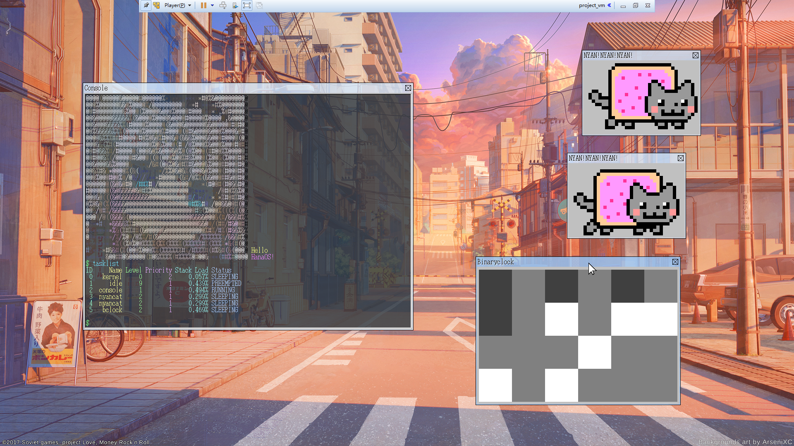

# 操作系统(CS302) Project —— kernel

生命不息，挖坑不止。

尝试用更现代化的方式实现OSASK类似的简易操作系统（伪）。

必须用32位MBR的grub2生成镜像，否则无法获得正确的显存地址（这个坑就不要去踩了，无解），轻则切换分辨率后无显示，重则导致虚拟机崩溃。

依赖工具：nasm, g++, g++-multilib, make, xorriso, mtools, qemu

~~推荐环境：MBR引导启动的32位Ubuntu~~

在64位或EFI引导的系统上需要安装grub-pc才能生成iso镜像。

bgimg.hpp就是张图片而已，编译完成后要占2M的空间，应该会被link到.rodata部分，嫌占空间删掉就得了。

5-1:折腾了大半天，中途好几次差点放弃，终于把中断处理实现了。顺便吐槽一下kernel的中断处理实现方法跟bootloader的区别非常大，OSASK的代码没啥参考价值。

5-3:花了一晚上调试鼠标后来发现vmware里面运行qemu有坑（手动喷血），原因不明。事实上OSASK的鼠标驱动放到kernel里没任何问题。

5-4:趁早上最清醒的时候调试，很快找到内存越界的原因，之前只有一个图层的时候用fb_stride32计算显存缓冲区偏移量，而现在有多个图层后继续这么算就会越界到其他图层的缓冲区，导致图层叠加出现问题。

5-25:OSASK的多任务实现方式在kernel中无法使用，所以多任务代码基本上参考[OSDev的教程](http://wiki.osdev.org/Kernel_Multitasking)，同时加入了删除任务的API。

书上18天之后就把书扔了，后面的功能完全从头实现。

App列表：
 - free（内存信息）
 - hello（卖萌）
 - poweroff（关机）
 - reboot（重启）
 - tasklist（任务列表）
 - window（测试窗口）

运行截图：

